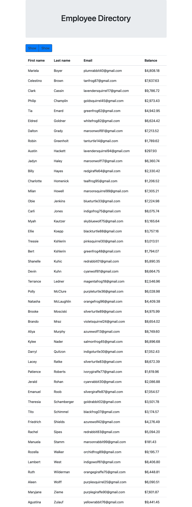

# Employee Directory

## Description 
This is a React-based web-application for displaying a listing of employees. The directory can be sorted by last name and filtered to show employees with GMAIL addresses.

## Table of Contents (Optional)

* [Usage](#usage)
* [Credits](#credits)
* [License](#license)

## Usage 
* Access at: https://omair-muhi.github.io/employee-directory/
* Screenshot: 

## Credits
* UoT FSF Bcamp - this template
* Week-19:01-Activities:16-FriendRefactor
* Week-19:01-Activities:20-Stu_AJAX
* ReactJS official docs

## License

MIT License

---
© 2019 Trilogy Education Services, a 2U, Inc. brand. All Rights Reserved.
